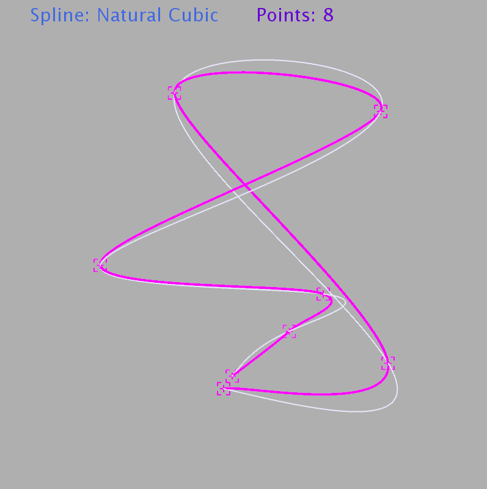

# Taller de splines

## Propósito

Estudiar algunos tipos de curvas paramétricas y sus propiedades.

## Tarea
Implemente las curvas cúbicas naturales, de Hermite y Bezier (cúbica y de grado 7)
Implemente las curvas cúbicas naturales, de Hermite y Bezier (cúbica y de grado 7), de acuerdo a las indicaciones del sketch adjunto.

*Sugerencia:* Como las curvas de Hermite y cúbica de Bezier requieren varias secciones, reacomode los puntos de control para que su continuidad sea C1. Ver [acá](https://visualcomputing.github.io/Curves/#/5/5) y [propiedad 4 de acá](https://visualcomputing.github.io/Curves/#/6/4).

## Profundización

Represente los _boids_ del [FlockOfBoids](https://github.com/VisualComputing/framesjs/tree/processing/examples/Advanced/FlockOfBoids) mediante superficies de spline.

## Integrantes

Máximo 3.

Complete la tabla:

| Integrante | github nick |
|------------|-------------|
| Laura Paola Cerón Martinez       | lpceronm        |
| Camilo Andrés Dajer Piñerez      | trum7           |

## Explicación

En el presente taller se realizo la implementación de las siguientes curvas:

 * Curvas cúbicas naturales: 
    
    Una curva cúbica es una curva que se encuentra construida de polinomios de tercer orden por partes que pasan a través de un conjunto de m puntos de control. Para nuestro caso de estudio se poseen 4 puntos de control.

    Basa en la siguiente [referencia](http://www.robots.ox.ac.uk/~ian/Teaching/CompGeom/lec4.pdf), se diseño un sistema de ecuaciones triangular, para hallar las derivadas correspondientes a cada segmento de polinomio. Con estos resultados fue posible hallar los coeficientes _aij_,_bij_,_cij_,_dij_ donde _i_ representa la coordenada en el espacio y _j_ representa el segmento de la curva a interpolar.
    
    

    Dando como resultado la siguiente:

    - Con 4 puntos de control:
    

    - Con 8 puntos de control:
    

    Como se puede observar, la ecuación funciona para _m_ puntos de control.
    
 * Curvas de Hermite:

    Estas curvas son una especificación de las curvas naturales, las cuales buscan interporlar segmentos de un polinomio de manera continua.

    Se busca que estas curvas posean una continuidad C1. El polinomio interpolador viene dado de manera parametrizada, donde el parametro _u_ varia entre 0 y 1, por lo cual si el parametro tiene un intervalo mas pequeño, la curva sera mucho más precisa.

    

 * Curvas de Bezier (cúbica y de grado 7):

    Dados unos puntos de control, que forman un poligono de control, se busca con Bezier encontrar una curva que se encuentre dentro del area del poligono, que trace la trayectoria de los 4 puntos.

    Para hallar el polinomio interpolador que cumpla con esta condición, se hace uso del algoritmo de _De Casteljau_, el cual es un metodo recursivo para evaluar polinomios.

    

    El algoritmo puede ser usado en 2 o más curvas de Bezier, dado un punto arbitrario dentro de las mismas.    

    Dando como resultado lo siguiente:

    - Con 4 puntos de control:
    

    - Con 8 puntos de control:
    

## Conclusión

    Despues de realizar diferentes pruebas, cambiando las curvas y el numero de puntos de control, pudimos concluir de manera subjetiva, que la curva de hermite, hace una aproximación mas precisa a la curva a representar.

## Referencias

- [Hermite - 1](  http://www.cubic.org/docs/hermite.htm )

- [Hermite - 2](  https://people.cs.clemson.edu/~dhouse/courses/405/notes/splines.pdf )

- [Hermite - 3](  https://en.wikipedia.org/wiki/Cubic_Hermite_spline
 )

- [Parametric curves - 1](  http://www.robots.ox.ac.uk/~ian/Teaching/CompGeom/lec4.pdf )

- [Matrix operations - 1](https://introcs.cs.princeton.edu/java/95linear/Matrix.java.html)

- [Natural - 1](http://mathworld.wolfram.com/CubicSpline.html)

- [Hermite - Natural - Bezier - 1](http://paulbourke.net/miscellaneous/interpolation/)

## Entrega

* Modo de entrega: Haga [fork](https://help.github.com/articles/fork-a-repo/) de la plantilla e informe la url del repo en la hoja *urls* de la plantilla compartida (una sola vez por grupo). Plazo: 6/5/18 a las 24h.
